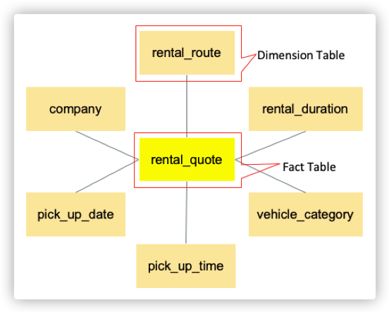

# RentalsScraping

## Usage

```
usage: scrape-quotes [-h] [--company-ids COMPANY_IDS [COMPANY_IDS ...]]
                     [--wait-element-timeout WAIT_ELEMENT_TIMEOUT]
                     [--dom-ready-timeout DOM_READY_TIMEOUT]
                     [--pool-size POOL_SIZE] [--batch-size BATCH_SIZE]
                     [--cache-capacity CACHE_CAPACITY] [--headless]
                     db_config_file_name

positional arguments:
  db_config_file_name   The database configuration file name. The available
                        names is/are: db_config.aws.ini, db_config.uc.ini

optional arguments:
  -h, --help            show this help message and exit
  --company-ids COMPANY_IDS [COMPANY_IDS ...]
                        A list of car rental company id, defaults to [1, 2,
                        3]. Thrifty: 1, Budget: 2, GO rentals: 3
  --wait-element-timeout WAIT_ELEMENT_TIMEOUT
                        The timeout used by the Selenium explicit waits,
                        defaults to 10 seconds
  --dom-ready-timeout DOM_READY_TIMEOUT
                        The timeout used to wait until the document.readyState
                        becomes complete, defaults to 10 seconds,
  --pool-size POOL_SIZE
                        The number of processes that the pool creates to
                        scrape quotes in parallel, defaults to 8
  --batch-size BATCH_SIZE
                        The number of pending scraping requests retrieved from
                        the database at a time, defaults to 1000
  --cache-capacity CACHE_CAPACITY
                        The maximun number of rental quotes that the cache can
                        accommodate, defaults to 1000
  --headless            Enable to use headless Chrome
```

## Project Dependencies

-   selenium==3.141.0

    `pip install selenium`

-   beautifulsoup4==4.9.3

    `pip install beautifulsoup4`

-   mysql-connector-python==8.0.21

    `pip install mysql-connector-python`

## Demo


## Discussions

### Concepts

-   <u>**Office**</u>: An entity which is composed of an id, a name and an address. The locations offered by car rental companies are essentially offices. They have been integrated to form locations which objectively exist. The office entity results from the m:n relationship between the company entity and the location entity.
-   <u>**Scraping Request**</u>: The factors that decide the car rental price include Company, Pick-up Location, Drop-off Location, Pick-up Date, Pick-up Time, Drop-off Date, Drop-off Time and Vehicle Category. These factors, except for the vehicle category, together forms a scraping request. Scraping requests are input to RentalsScraping. They are offered by the database. A scraping request tells RentalsScraping which car rental company website should be visited and what data should be filled into the booking form.
-   <u>**Scraping Response**</u>: A list of items each of which is composed of a vehicle category name, a vehicle category description, a vehicle age description and a price. For Thrifty and Budget, the vehicle category description and the vehicle age description are empty. For Go rentals the vehicle category description and the vehicle age description are mandatory.
-   <u>**Pending Scraping Request**</u>: A scraping request whose corresponding rental quotes have not been scraped and saved to the database.
-   <u>**Processed Scraping Request**</u>: A scraping request whose corresponding rental quotes have been scraped and saved to the database.
-   <u>**Scraping Request Statistics**</u>: An object which reflects the total number of scraping requests and the number of processed scraping requests for a designated company and a scraping date.
-   <u>**Rental Quote**</u>: An entity that is composed of an id, a company id, a rental route id, a pick-up date id, a pick-up time id, a rental duration id, a vehicle category id, a price and a timestamp which records when it was created.
-   <u>**Scraping Date**</u>: When RentalsScraping starts to run, the scraping date is the current date. It is used as one of the parameters to ask the database for the corresponding scraping requests that will be processed on the current date. The scraping date is always the current date as time flows.
-   <u>**Rental Route**</u>: A pair of locations from which one represents the pick-up location and the other represents the drop-off location. It results from the m:n relationship between location entities. Each car rental company offers customers a number of rental routes.
-   <u>**Rental Duration**</u>: The number of rental days. Adding a rental duration to a pick-up date and time results in a drop-off date and time.

### Scraping Request Formation Mechanism

The following description explains how scraping requests are formed. Let’s assume a car rental company named FCRC has two offices in A and B two locations. The rental routes offered by the company is a permutation of its offices’ locations. So, the rental routes are (A, A), (A, B), (B, A) and (B, B). The scraping date is 18/11/2020. The pick-up date is always the day next to the scraping date, so it is 19/11/2020. The pick-up time is 10:00 AM. The rental durations are 1 day and 3 days. The formed scraping requests are the permutation of the rental routes, the pick-up date, the pick-up time and rental durations. They are illustrated by the following table.

| Id  | Company | Pick-up Location | Drop-off Location | Pick-up Date | Pick-up Time | Drop-off Date | Drop-off Time |
| --- | ------- | ---------------- | ----------------- | ------------ | ------------ | ------------- | ------------- |
| 1   | FCRC    | A                | A                 | 19/11/2020   | 10:00 AM     | 20/11/2020    | 10:00 AM      |
| 2   | FCRC    | A                | A                 | 19/11/2020   | 10:00 AM     | 22/11/2020    | 10:00 AM      |
| 3   | FCRC    | A                | B                 | 19/11/2020   | 10:00 AM     | 20/11/2020    | 10:00 AM      |
| 4   | FCRC    | A                | B                 | 19/11/2020   | 10:00 AM     | 22/11/2020    | 10:00 AM      |
| 5   | FCRC    | B                | A                 | 19/11/2020   | 10:00 AM     | 20/11/2020    | 10:00 AM      |
| 6   | FCRC    | B                | A                 | 19/11/2020   | 10:00 AM     | 22/11/2020    | 10:00 AM      |
| 7   | FCRC    | B                | B                 | 19/11/2020   | 10:00 AM     | 20/11/2020    | 10:00 AM      |
| 8   | FCRC    | B                | B                 | 19/11/2020   | 10:00 AM     | 22/11/2020    | 10:00 AM      |

It can be seen that 8 scraping requests are formed. The formula to calculate the number of scraping requests for a company and a designated scraping date is:

<font color="blue">[Number of Rental Routes] _ [Number of Pick-up Times] _ [Number of Rental Durations]</font>

### Location Integration

Car rental companies set locations for customers to pick up and drop off cars. By looking through all locations from all companies, it can be found that some are completely the same, e.g., the Auckland Airport. Some look different but are essentially the same, e.g., the Auckland Downtown and Auckland City. In order to make rental quotes comparable, the location integration must be done. Thrifty, Budget and Go rentals has 28, 34, 6 locations respectively. After integration the number of locations is 38. Because of the location integration, car rental company’s location is actually the office in that location. The final locations can be seen in the appendices.

### Vehicle Category Integration

Car rental companies offer variety of vehicles. By examining all vehicle categories from all companies, it can be found that some look different but essentially the same, e.g. “Compact SUV 2WD” from Thrifty, “Compact SUV” from Budget and “Small Cars - Toyota CHR or similar” from Go rentals. In order to make rental quotes comparable, the vehicle category integration must be done. Thrifty, Budget and Go rentals has 10, 14, 18 vehicle categories respectively. After the integration the number of vehicle categories is 23. The final vehicle categories can be seen in the appendices.

### Database Design

The database used in the project is MySQL which is a relational database. It not only stores data relating to scraping request and rental quotes but also provides routines for RentalsScraping to invoke to achieve the goal. The database design follows the star schema style so the data in the database can be easily analyzed and the database can be easily extended and integrated into a data warehouse. The fact table is rental_quote because it records car rental price information. The dimension tables surrounding the fact table include company, rental_route, pick_up_date, pick_up_time, rental_duration and vehicle_category. The shape of the database schema looks like a star (Figure 1). The detailed entity relationship diagram (ERD) can be seen in the appendices.


<center>Figure 1</center>

### Database Initialization

The dimension tables surrounding the fact table should be initialized. The company, pick_up_time, vehicle_category and rental_duration dimension tables are filled with data through a manual process. The initial data for these tables can be found in the appendices. The pick_up_date dimension table is updated as RentalsScraping runs day by day. The rental_route dimension table is filled with data through an automatic process. Car rental companies usually provide a locations page on their website. A utility program is created to scrape locations from these pages. A simple location integration rule is imposed on the process of scraping locations. When the utility program finishes its work, the location, office, rental_route tables will be filled. In addition, the utility program can also be used to update these tables when companies have changed their locations.

### Database Views

-   <u>**company_rental_route**</u>: A view from which the available rental routes for a company can be queried. There is no direct relationship between the company entity and the rental route entity. However, the available rental routes for a company should be known. The company_rental_route view plays the role. It was created by joining two office tables from which one acts as the pick-up office and the other acts as the drop-off office, the rental_route table, two location tables from which one acts as the pick-up location and the other acts as the drop-off location. The view provides information such as company id, rental route id, pick-up office id, pick-up office name, pick-up office address, pick-up location id, pick-up location name, drop-off office id, drop-off office name, drop-off office address, drop-off location id and drop-off location name.

### Database Routines

-   <u>**add_office**</u>: A procedure that accepts a company id, a name and an address to create a new office or update an existing office. It is invoked by the utility program which scrapes locations from car rental companies’ websites. When it runs, it begins a transaction, then it invokes the get_location_name procedure to get the location name, next it uses the location name to query the location id, if the location id doesn’t exist it creates a new location, then it uses the company id and the location id to query the office id, if the office id doesn’t exist, it creates a new office, if the office id does exist, it updates the office’s name and address. During this process, if no error occurs, it commits the transaction, or rollbacks the transaction vice versa.
-   <u>**get_location_name**</u>: A procedure that transforms an office name to a location name. It is the implementation of the location integration rule and invoked by the utility program to add offices to the database.
-   <u>**get_scraping_request_statistics**</u>: A procedure that accepts a company id and a formatted scraping date string to get the statistics about the scraping requests. The statistics include two values from which one represents the total number of scraping requests that need to be processed and the number of scraping requests that have been processed.
-   <u>**get_pending_scraping_requests**</u>: A procedure that accepts a company id, a formatted scraping date string, an offset and a row count to return scraping requests that have not been processed. In order to decrease the pressure on the database, the pending scraping requests are divided into batches. The combination of offset and row count defines the range of a division.
-   <u>**get_vehicle_catetory_id**</u>: A function that accepts a company id, a vehicle category name, a vehicle category description and a vehicle age description to return a corresponding vehicle category id. It is the implementation of the vehicle category integration rule. The rule can be seen in the appendices. It is invoked by RentalsScraping for saving rental quotes to the database.
-   <u>**refresh_rental_routes**</u>: A procedure that finds new rental routes which results from the change of locations and adds these new rental routes to the rental_route table. It is invoked by the utility program that scrapes locations from car rental companies’ websites. In addition, when a change happens to the location table, this procedure should be invoked to keep the rental routes up to date.
-   <u>**debug_msg**</u>: A procedure that accepts a parameter named ‘enabled’ and a message and outputs the message if the ‘enabled’ parameter is true. It is used in several routines to debug errors.

### RentalsScraping Workflow

A UML activity diagram (Figure 2) is used to describe the RentalsScraping workflow which consists of the following steps:

1. When RentalsScraping starts to run, it parses the command line arguments to get the configuration which includes from which companies to scrape rental quotes, the path of the database configuration file, how many processes the multiprocessing pool should create, the size of the cache, the size of the batch and whether to use headless chrome browser.
2. It validates the command line arguments. For example, the passed companies will be validated, the number of the processes which are created by the multiprocessing pool should not exceed the number of CPU cores etc.
3. Set the scraping date to today.
4. Fetch an array of scraping request statistics. Each item in the array corresponds to a company.
5. Filter the companies of which the number of pending scraping requests is greater than 0.
6. If the list of companies obtained from the step 5 is empty, then RentalsScraping starts to sleep until tomorrow. When it wakes up, it enters the step 3.
7. If the list of companies obtained from the step 5 is not empty, then a cache which boosts the performance of saving rental quotes to the database is created.
8. Iterate the following process of scraping quotes for every company in the list
    1. Take a pending company from the company list.
    2. Fetch a batch of pending scraping requests for the designated company.
    3. If the number of pending scraping requests is 0 then RentalsScraping enters the step 8.1.
    4. If the number of pending scraping requests is greater than 0 then these requests are allocated to the multiprocessing pool.
    5. The processes in the multiprocessing pool generate rental quotes. When rental quotes are available, RentalsScraping manages to add them to the cache. During this process, if the available space of the cache is not big enough for the rental quotes, then the cache flushes. All data in the cache is written to the database.
    6. When the multiprocessing pool has handled all pending scraping requests, rental quotes become unavailable. At the moment, the cache flushes.
    7. Check whether the scraping date passed. If it didn’t, RentalsScraping enters the step 8.2, or RentalsScraping enters the step 3.

The characteristics of RentalsScraping include being able to keep running until been shut down intentionally, being able to reliably find elements on the web page and set their values, being able to use a cache mechanism to boost performance of saving data to the database, being able to recover from exception without loss of data, being able to use Python’s multiprocessing ability to process scraping requests in parallel.


   <center>Figure 2</center>

### Explicit Wait

Explicit Wait is an ability provided by Selenium which allows a piece of code to wait until a certain condition to occur. It is indispensable because modern websites are quite dynamic. The completion of loading for a web page doesn’t guarantee every element on it can be operated. For example, in order to select an option in a HTML select control, code must wait until the options of the select have been loaded. Selenium provides a lot of built-in conditions, e.g., checking if the element is visible, checking if the given text is in the element etc. RentalsScraping not only makes use of these built-in conditions but also implements custom conditions according to special requirements.

-   <u>**visibility_of_office_address_element**</u>: A condition used to wait for the expected suggested address to appear when inputting in the pick-up location input and drop-off location input on Budget’s website.
-   <u>**target_month_year_to_be_visible**</u>: A condition used to wait for a target month in a year, e.g. ‘November 2020’, to appear in a date picker on the websites.
-   <u>**visibility_of_day_link**</u>: A conditon used to wait for a certain day to appear in a date picker on the Go rental’s website.
-   <u>**html_input_has_value**</u>: A condition used to wait until the input has a value that is not empty.
-   <u>**html_text_has_been_added**</u>: A condition used to wait until the text of an element is not empty.

### Date Selection

In order to scrape quotes, the pick-up date and the drop-off date must be specified. Date pickers (Figure 3, Figure 4, Figure 5) are usually provided to facilitate date selection. The way to select a date on Thrifty’s website is similar to that on Go rentals’s website. The basic idea is to compare the month and year of the date with the current month and year (2). If the difference is equal to 0, then find the day link in the day area (4) and click it. If the difference is less than 0, click the left move link (1) “difference” times to reach the target month and year, then find the day link in the day area and click it. If the difference is greater than 0, click the right move link (3) “difference” times to reach the target month and year, then find the day link in the day area and click it.


<center>Figure 3 Thrifty's Date Picker</center>


<center>Figure 4 Go rentals’s Date Picker</center>
The way to select a date on Budget’s website is relatively complex because two adjacent month and year appear, e.g. November 2020 and December 2020. The basic idea is to compare the month and year of the date with the left month and year (2) and the right month and year (3). If the left difference is 0 or the right difference is 0, then find the day in the left day area (5) or the right day area (6) respectively and click it. If the left difference is less than 0, click the left move link (1) “left difference” times to reach the target month and year, then find the day link in the left day area and click it. If the right difference is greater than 0, click the right move link (4) “right difference” times to reach the target month and year, then find the day link in the right day area and click it.


<center>Figure 5 Budget’s Date Picker</center>
In addition, the date pickers on the websites prevent customers from selecting a date that is earlier than the current date by disabling corresponding day links and move links. They way RentalsScraping select a date is compatible with this restriction.

### Assembly for Rental Quotes

When RentalsScraping reaches the web page that provides information about rental quotes, it doesn’t need to do any simulations of user interaction, so it uses Beautifulsoup to digest the page HTML code to get the scraping response. The items in the scraping response that doesn’t have a price are filtered out. If the number of items in the filtered scraping response is 0, then a rental quote which just copies the information from the scraping request and adds the current time is created. It functions as a mark that a scraping request has been processed. If the number of items in the scraping response is greater than 0, rental quotes are assembled by taking each item from the scraping response, combining it with the scraping request and the current time.

### Caching Mechanism

A simple caching mechanism is used to boost the performance of saving rental quotes to the database. Saving rental quotes in high frequency can cause performance degradation. Rental quotes are not saved to the database after they have been created. They are added into the cache first. The cache takes the responsibility of saving rental quotes in bulk to the database. By default, the cache can accommodate 1000 rental quotes. The capacity of the cache can be customized.

### Batch Processing

For a company and a scraping date, the number of pending scraping requests could be more than 10,000. Fetching all of them at once can cause performance degradation. So, they are divided into batches. Each time only a batch of pending scraping requests is fetched. The size of the batch is 1000 by default and can be customized.

### Parallel Processing

Parallel processing can significantly reduce the total time spent on scraping. It is implemented by using the Python built-in package named multiprocessing. RentalsScraping exploits the Pool in the multiprocessing package to process pending scraping requests in parallel. The pool creates processes and allocates pending scraping requests to them. The processes keep working until all pending scraping requests have been processed. The number of processes created by the pool is the number of CPU cores by default and can be customized to a number which is greater than 0 and less than or equal to the number of CPU cores.

### Logging

The Python built-in package named logging is used to log events. The event types include information, warning and errors. Logs show on the console and are saved to log files.

### Program Performance

It is observed that processing 276 pending scraping requests on a laptop with a 2 GHz Quad-Core Intel Core i7 CPU (8 cores) and 8 GB 1600 MHz DDR3 memory costs about 13 minutes. The average time to process a pending request is estimated to be 3 seconds.

## Analysis of Number of Scraping Requests for a Designated Date

For **Thrifty**, it has **28** locations, namely **784** (28 \* 28) rental routes. There are **7840** (784 \* 2 \* 5) scraping requests. Each scraping request could bring **1** to **10** rental quotes. So the total of rental quotes could be **7840** to **78400** (7840 \* 10).

For **Budget**, it has **35** locations, namely **1225** (35 \* 35) rental routes. There are **12250** (1225 \* 2 \* 5) scraping requests. Each scraping request could bring **1** to **10** rental quotes. So the total of rental quotes could be **12250** to **122500** (12250 \* 10).

For **GO Rentals**, it has **6** locations, namely **36** (6 \* 6) rental routes. There are **360** (36 \* 2 \* 5) scraping requests. Each scraping request could bring around **20** rental quotes. So the total of rental quotes could be **360** to **7200** (360 \* 20).

In summary, we have **3** companies, **2045** (784 + 1225 + 36) rental routes, **20450** (7840 + 12250 + 360) scraping requests and collect **20450** (7840 + 12250 + 360) to **208100** (78400 + 122500 + 7200) rental quotes.

## References

-   https://selenium-python.readthedocs.io/
-   [Beautiful Soup Documentation](https://www.crummy.com/software/BeautifulSoup/bs4/doc/)
-   https://dev.mysql.com/doc/connector-python/en/
-   https://www.crummy.com/software/BeautifulSoup/bs4/doc/
-   https://stackoverflow.com/questions/43164411/why-do-we-still-need-parser-like-beautifulsoup-if-we-can-use-selenium
-   Check the timezone of db server: SELECT @@global.time_zone;
-   Set timezone in MySql workbench: set time_zone = '+13:00';
-   [WebDriver click() vs JavaScript click()](https://stackoverflow.com/questions/34562061/webdriver-click-vs-javascript-click)
-   [Selenium WebDriver How to Resolve Stale Element Reference Exception?](https://stackoverflow.com/questions/16166261/selenium-webdriver-how-to-resolve-stale-element-reference-exception)
-   [ChromeDriver - WebDriver for Chrome](https://chromedriver.chromium.org/)
-   [Context managers and multiprocessing pools](https://stackoverflow.com/questions/24717468/context-managers-and-multiprocessing-pools)
-   [multiprocessing.Pool: What's the difference between map_async and imap?](https://stackoverflow.com/questions/26520781/multiprocessing-pool-whats-the-difference-between-map-async-and-imap)
-   [In what situation do we need to use 'multiprocessing.Pool.imap_unordered'?](https://stackoverflow.com/questions/19063238/in-what-situation-do-we-need-to-use-multiprocessing-pool-imap-unordered)
-   Add RentalsScraping to /usr/local/bin
    -   `ln -s [The absolute path to bin/scrape_quotes.py] /usr/local/bin/scrape-quotes`
    -   `chmod 755 /usr/local/bin/scrape-quotes`
-   [Logging in Python](https://realpython.com/python-logging/)
-   [Python3: Logging With Multiprocessing](https://medium.com/@jonathonbao/python3-logging-with-multiprocessing-f51f460b8778)

## Appendices

### Vehicle Category Integration Rule

-   [vehicle_category_integration_rule.xlsx](./doc/vehicle_category_integration_rule.xlsx)

### ERD


### Database Initialization Data

<u>**company**</u>

| id  | name       |
| --- | ---------- |
| 1   | Thrifty    |
| 2   | Budget     |
| 3   | GO rentals |

<u>**location**</u>

| id  | name                            |
| --- | ------------------------------- |
| 1   | Auckland Airport                |
| 2   | Auckland City                   |
| 3   | Auckland International Airport  |
| 4   | Blenheim Airport                |
| 5   | Christchurch Airport            |
| 6   | Christchurch City               |
| 7   | Dunedin Airport                 |
| 8   | Dunedin City                    |
| 9   | Gisborne Airport                |
| 10  | Gisborne City                   |
| 11  | Greymouth Railway Station       |
| 12  | Hamilton Airport                |
| 13  | Hamilton City                   |
| 14  | Hokitika Airport                |
| 15  | Invercargill Airport            |
| 16  | Napier Airport                  |
| 17  | Nelson Airport                  |
| 18  | New Plymouth Airport            |
| 19  | Palmerston North Airport        |
| 20  | Picton Ferry                    |
| 21  | Queenstown Airport              |
| 22  | Rotorua Airport                 |
| 23  | Taupo Airport                   |
| 24  | Tauranga Airport                |
| 25  | Tauranga City                   |
| 26  | Wellington Airport              |
| 27  | Wellington City                 |
| 28  | Westport Airport                |
| 29  | Auckland Penrose                |
| 30  | Christchurch Sheffield Crescent |
| 31  | Kerikeri Airport                |
| 32  | New Plymouth City               |
| 33  | Queenstown City                 |
| 34  | Rotorua City                    |
| 35  | Taupo City                      |
| 36  | Wellington Ferry                |
| 37  | Petone Lower Hutt               |
| 38  | Whangarei Airport               |

<u>**pick_up_time**</u>

| id  | value    |
| --- | -------- |
| 1   | 10:00:00 |
| 2   | 14:00:00 |

<u>**rental_duration**</u>

| id  | number_of_days |
| --- | -------------- |
| 1   | 1              |
| 2   | 2              |
| 3   | 3              |
| 4   | 4              |
| 5   | 5              |

<u>**vehicle_category**</u>

| id  | name description                                                |
| --- | --------------------------------------------------------------- |
| 1   | Economy Car Toyota Yaris or similar                             |
| 2   | Compact Auto Toyota Corolla, Hyundai Accent or similar          |
| 3   | Compact SUV 2WD Holden Trax or similar                          |
| 4   | Intermediate SUV AWD Toyota RAV4 or similar                     |
| 5   | Fullsize AWD (seats 5-7 passengers) Hyundai Santa Fe or Similar |
| 6   | Passenger Van Toyota Hiace or similar                           |
| 7   | Utility Vehicle with towbar Toyota Hilux with towbar or similar |
| 8   | Intermediate SUV 2WD Mitsubishi Eclipse or similar              |
| 9   | Luxury Van Hyundai iMax                                         |
| 10  | Electric Vehicle Hyundai IONIQ with 200km range                 |
| 11  | Intermediate Car Hyundai Elantra or similar                     |
| 12  | Full Size Car Toyota Camry or similar                           |
| 13  | Full Size Elite Car Holden Commodore or similar                 |
| 14  | Full Size Hybrid Car Toyota Camry Hybrid or similar             |
| 15  | Premium SUV Toyota Prado or similar                             |
| 16  | Compact Auto[3 year(s) old] Toyota Corolla Hatch                |
| 17  | Compact Auto[4 - 5 year(s) old] Toyota Corolla Hatch            |
| 18  | Intermediate Car[5 year(s) old] Toyota Corolla Sedan            |
| 19  | Intermediate Car[2 - 3 year(s) old] Toyota Corolla Sedan        |
| 20  | Passenger Van[10 Seats] Toyota Hiace (10 Seater)                |
| 21  | Luggage Trailer Luggage Trailer                                 |
| 22  | Manual Cars Toyota Corolla Manual                               |
| 23  | Compact Hybrid Car Toyota Corolla Hybrid or similar             |
